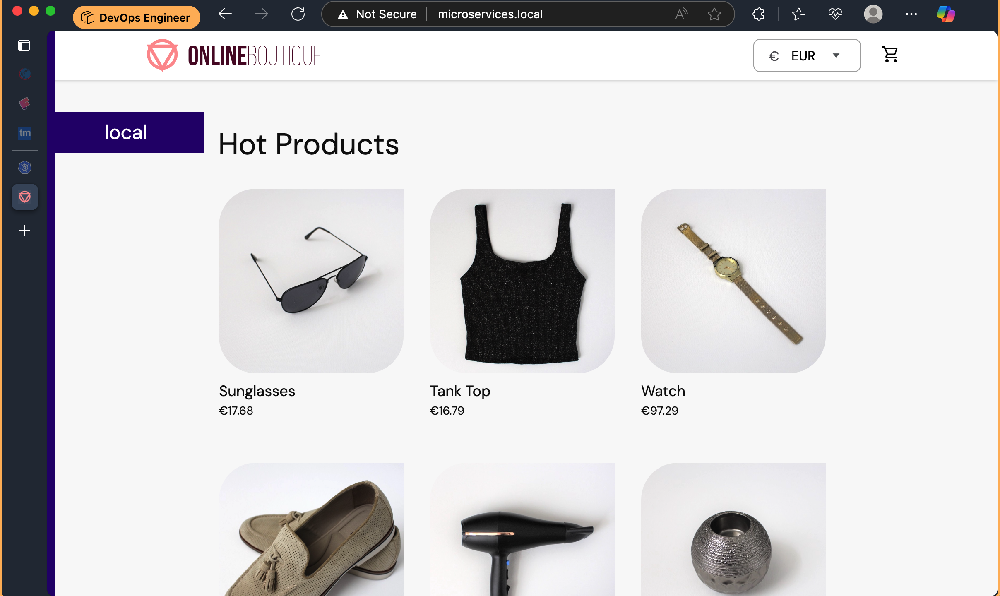
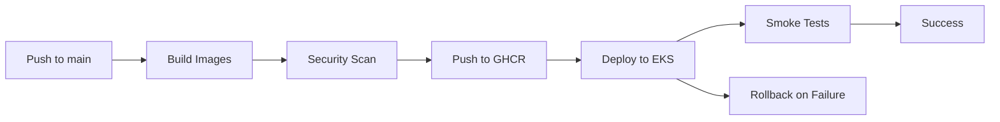
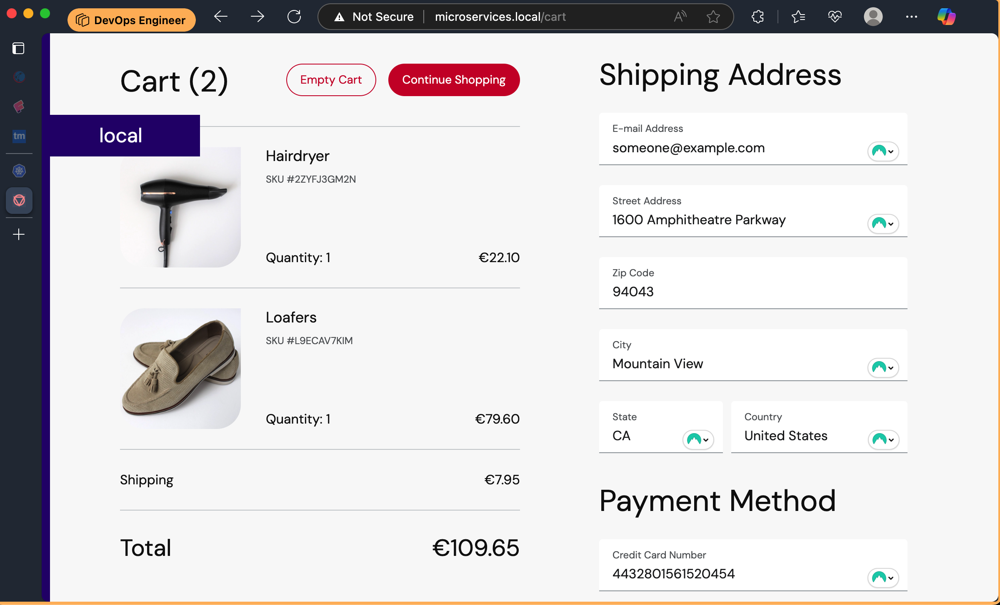
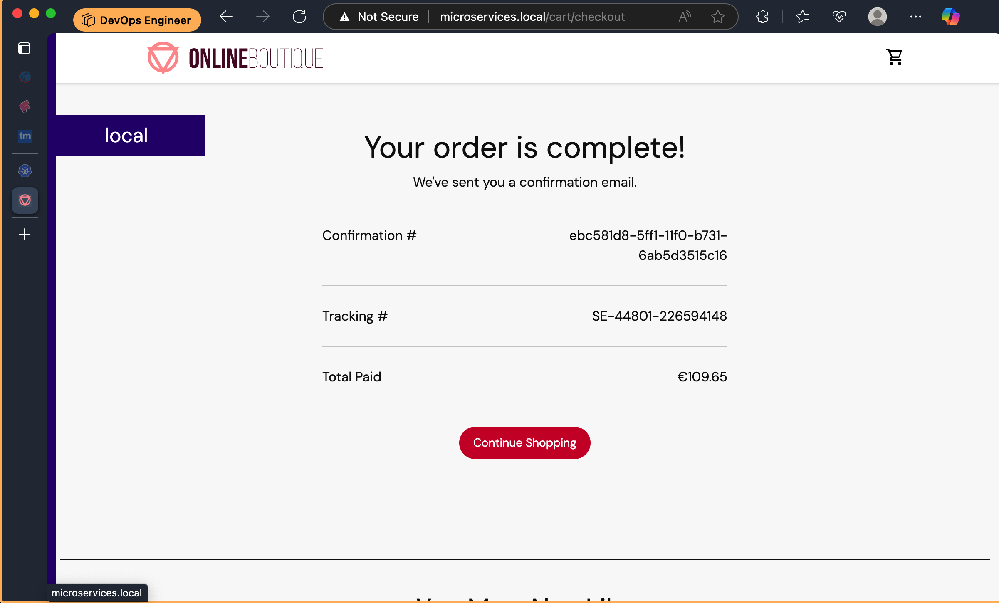

# DevOps Microservices Platform on AWS EKS

[](https://aws.amazon.com/eks/)
[](https://kubernetes.io/)
[](https://terraform.io/)
[](https://helm.sh/)
[](https://prometheus.io/)
[](https://grafana.com/)


**Enterprise-grade DevOps platform** demonstrating production-ready microservices deployment on AWS EKS with complete CI/CD pipeline, Infrastructure as Code, monitoring, and operational best practices.



## 🏗️ DevOps Infrastructure Architecture

This platform demonstrates **enterprise DevOps practices** for microservices deployment, featuring:

### Infrastructure Components
- **AWS EKS Cluster** with managed node groups and auto-scaling
- **Application Load Balancer (ALB)** with AWS Load Balancer Controller
- **Amazon ECR** for container image registry
- **AWS Secrets Manager** integration for secure configuration
- **CloudWatch** for centralized logging and monitoring
- **Route53** for DNS management and service discovery

### DevOps Automation
- **Infrastructure as Code** with Terraform and Helm charts
- **CI/CD Pipeline** with GitHub Actions and GitOps
- **Automated Testing** with security scanning and quality gates
- **Blue-Green Deployments** with zero-downtime releases
- **Monitoring & Alerting** with Prometheus and Grafana
- **Incident Response** with runbooks and escalation procedures

## 🎯 Original Work Attribution

This deployment is based on the excellent [Google Cloud Microservices Demo](https://github.com/GoogleCloudPlatform/microservices-demo) (formerly known as "Hipster Shop"). The original demo was created by Google Cloud Platform team to demonstrate cloud-native application development.

**Key Enhancements Made:**
- ✅ Kubernetes-native deployment manifests
- ✅ Namespace isolation and security hardening  
- ✅ Fixed service port mappings and health probes
- ✅ Redis authentication and connection optimization
- ✅ Production-ready resource limits and configurations
- ✅ Ingress controller setup for external access

## 🚀 Services Architecture

| Service | Language | Port | Description |
|---------|----------|------|-------------|
| **Frontend** | Go | 8080 | Web UI and API gateway |
| **Cart Service** | C# | 7070 | Shopping cart management |
| **Product Catalog** | Go | 8080 | Product inventory and details |
| **Currency Service** | Node.js | 8080 | Currency conversion |
| **Payment Service** | Node.js | 8080 | Payment processing |
| **Shipping Service** | Go | 8080 | Shipping cost calculation |
| **Email Service** | Python | 8080 | Order confirmation emails |
| **Checkout Service** | Go | 5050 | Order processing workflow |
| **Recommendation** | Python | 8080 | Product recommendations |
| **Ad Service** | Java | 9555 | Contextual advertisements |
| **Redis Cart** | Redis | 6379 | Session and cart storage |
| **Load Generator** | Python | - | Traffic simulation |

## 🔄 CI/CD Pipeline

### Pipeline Workflow


### Path-Based Triggers
Pipeline runs only when relevant files change:
- **Source Code**: `microservices-demo/src/**`
- **Kubernetes Manifests**: `k8s-manifests/**`
- **Helm Charts**: `microservices-helm-chart/**`
- **Workflows**: `.github/workflows/**`
- **Dockerfiles**: `Dockerfile*`
- **Documentation**: `*.md` (push only)

### Security Integration
- **Trivy Scanning** - Vulnerability detection for all images
- **SARIF Upload** - Security results in GitHub Security tab
- **Dependency Scanning** - Automated security monitoring
- **Container Signing** - Image integrity verification

### Deployment Features
- **Zero-Downtime** - Rolling updates with health checks
- **Auto-Rollback** - Automatic rollback on deployment failure
- **Multi-Environment** - Support for staging and production
- **GitOps Ready** - Infrastructure as Code with Helm
- **Smart Triggers** - Path filtering to optimize CI/CD resources

## 📚 Documentation

- **[Deployment Guide](DEPLOYMENT_GUIDE.md)** - Complete step-by-step deployment instructions
- **[Troubleshooting Guide](TROUBLESHOOTING.md)** - Common issues and solutions
- **[Architecture Guide](ARCHITECTURE.md)** - Detailed technical architecture and service interconnections
- **[Autoscaling Guide](AUTOSCALING.md)** - HPA implementation and monitoring

## 📋 Prerequisites

- **Kubernetes Cluster** (v1.20+)
- **kubectl** configured and connected
- **NGINX Ingress Controller** installed
- **Docker** (for custom image builds)
- **Minimum Resources**: 4 CPU cores, 8GB RAM

### Quick Setup Commands

```bash
# Install NGINX Ingress Controller
kubectl apply -f https://raw.githubusercontent.com/kubernetes/ingress-nginx/controller-v1.8.1/deploy/static/provider/cloud/deploy.yaml

# Install Metrics Server (for HPA)
kubectl apply -f https://github.com/kubernetes-sigs/metrics-server/releases/latest/download/components.yaml

# Verify installation
kubectl get pods -n ingress-nginx
kubectl get pods -n kube-system | grep metrics-server
```

## 🛠️ Deployment Instructions

### Automated CI/CD Pipeline

**Prerequisites:**
- AWS EKS cluster running
- GitHub repository with proper secrets configured

**Required GitHub Secrets:**
```bash
AWS_ACCESS_KEY_ID=AKIA...
AWS_SECRET_ACCESS_KEY=...
AWS_REGION=us-east-1
EKS_CLUSTER_NAME=my-eks-cluster
```

**Pipeline Features:**
- ✅ **Matrix Build** - Builds all 12 microservices in parallel
- ✅ **Security Scanning** - Trivy vulnerability scanning with SARIF upload
- ✅ **Container Registry** - Pushes to GitHub Container Registry (GHCR)
- ✅ **EKS Deployment** - Automated Helm deployment to EKS
- ✅ **Smoke Tests** - Post-deployment health checks
- ✅ **Rollback** - Automatic rollback on deployment failure
- ✅ **Path Filtering** - Optimized triggers for relevant file changes

**Automatic Deployment:**
- Push to `main` branch triggers the pipeline
- Pipeline: Build → Scan → Push to GHCR → Deploy to EKS
- Manual trigger via GitHub Actions UI

### Manual Deployment

```bash
# Deploy all services
kubectl apply -f k8s-manifests/

# Verify deployment
kubectl get pods -n microservices
kubectl get svc -n microservices
```



### Access the Application
```bash
# Add to /etc/hosts (for local access)
echo "127.0.0.1 microservices.local" | sudo tee -a /etc/hosts

# Access the application
http://microservices.local/
```


## 🔧 Configuration Details

### Environment Variables
Key configurations managed via ConfigMap:
- Service discovery endpoints
- Feature flags (tracing, profiling)
- Application ports and timeouts

### Secrets Management
Sensitive data stored in Kubernetes Secrets:
- Redis authentication password
- API keys for external services

### Resource Allocation
Each service configured with:
- **CPU Requests**: 100-300m
- **Memory Requests**: 64-256Mi  
- **CPU Limits**: 200-500m
- **Memory Limits**: 128-512Mi

### Autoscaling
Horizontal Pod Autoscaler (HPA) configured for:
- **Frontend**: 2-10 replicas (70% CPU, 80% memory)
- **Cart Service**: 1-8 replicas (75% CPU)
- **Checkout Service**: 1-6 replicas (70% CPU)
- **Product Catalog**: 1-5 replicas (80% CPU)
- **Recommendation**: 1-4 replicas (75% CPU)

## 🔍 Monitoring & Debugging



### Kubernetes Lens Integration
This project is monitored using [Kubernetes Lens](https://k8slens.dev/) for comprehensive cluster visualization and management.

### Health Checks
```bash
# Check pod health
kubectl describe pod <pod-name> -n microservices

# View logs
kubectl logs <pod-name> -n microservices

# Port forward for debugging
kubectl port-forward -n microservices svc/frontend 8080:80
```

### Common Issues & Solutions

| Issue | Solution |
|-------|----------|
| Pods CrashLoopBackOff | Check logs: `kubectl logs <pod> -n microservices` |
| Service connection refused | Verify port mappings in service manifests |
| Redis authentication failed | Check REDIS_ADDR connection string format |
| Ingress not accessible | Verify NGINX Ingress Controller is running |

## 🏷️ Service Tags & Images

**Container Registry:** GitHub Container Registry (GHCR)
```
ghcr.io/your-username/microservices-<service-name>:latest
ghcr.io/your-username/microservices-<service-name>:<commit-sha>
```

**Available Images (12 Services):**
- `microservices-frontend`
- `microservices-cartservice`
- `microservices-productcatalogservice`
- `microservices-currencyservice`
- `microservices-paymentservice`
- `microservices-shippingservice`
- `microservices-emailservice`
- `microservices-checkoutservice`
- `microservices-recommendationservice`
- `microservices-adservice`
- `microservices-loadgenerator`
- `microservices-shoppingassistantservice`

**CI/CD Pipeline:**
- **Build:** Matrix builds all 12 microservice images in parallel
- **Scan:** Trivy security scanning with GitHub Security integration
- **Deploy:** Automated Helm deployment to EKS with health checks

**Manual Build:**
```bash
# Build and push individual service
./scripts/build-and-push.sh your-username latest
```

## 🔐 Security Features

- **Namespace Isolation**: All resources deployed in dedicated namespace
- **Secret Management**: Sensitive data encrypted in Kubernetes Secrets
- **Network Policies**: Service-to-service communication controls
- **Resource Limits**: Prevent resource exhaustion attacks
- **Redis Authentication**: Password-protected cache access

## 📊 Performance & Scaling

### Horizontal Pod Autoscaling
```bash
# Deploy HPA configurations
kubectl apply -f k8s-manifests/16-hpa.yaml

# Monitor scaling
kubectl get hpa -n microservices
kubectl top pods -n microservices
```

### Load Testing
Use the included load generator:
```bash
kubectl logs -f deployment/loadgenerator -n microservices
```


## 🤝 Contributing

1. Fork the repository
2. Create a feature branch
3. Make your changes
4. Test thoroughly
5. Submit a pull request

## 📄 License

This project is licensed under the Apache License 2.0 - see the [LICENSE](LICENSE) file for details.

## 🙏 Acknowledgments

- **Google Cloud Platform Team** for the original microservices demo
- **Kubernetes Community** for the excellent orchestration platform
- **CNCF Projects** (Kubernetes, gRPC, etc.) for cloud-native technologies

## 📞 Support

For issues and questions:
- Create an issue in this repository
- Check the [troubleshooting guide](#-monitoring--debugging)
- Review the original [Google Cloud Microservices Demo](https://github.com/GoogleCloudPlatform/microservices-demo)

---

**⭐ Star this repository if it helped you learn Kubernetes microservices deployment!**